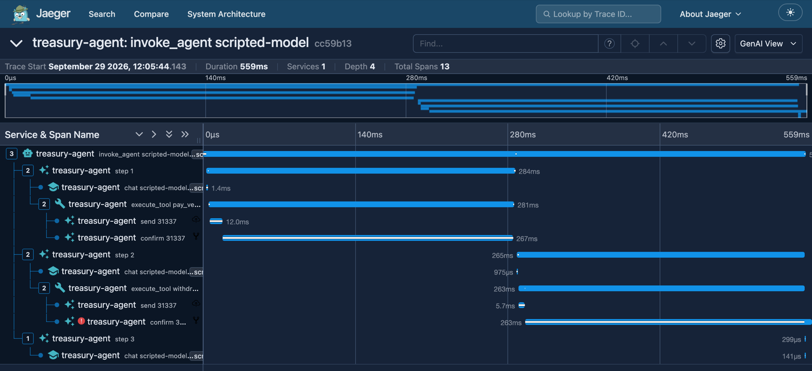

# hashspan

**Trace your AI agents' on-chain transactions with OpenTelemetry.**

hashspan turns every transaction an agent sends into spans, keyed by the transaction hash, inside the agent's
own OpenTelemetry trace.

[](https://github.com/selimaytac/hashspan/actions/workflows/ci.yml)
[](https://www.npmjs.com/package/@hashspan/core)
[](https://www.npmjs.com/package/@hashspan/viem)
[](LICENSE)

> **Status: early (0.x).** Published with npm provenance; span and attribute names are still marked `development`
> ([semantic conventions](docs/semconv.md)) and may change in minor releases. Feedback on the schema is very welcome;
> see the [roadmap](docs/roadmap.md).

When an AI agent sends a transaction, the agent trace usually stops at the tool call. Whether the transaction was
mined, reverted, or what it cost lives somewhere else. hashspan closes that gap: each transaction becomes a
`send` / `confirm` span pair **inside the agent's own trace**, with status, gas, L2 fees and the agent identity
attached, and it's exported to the backend you already use (Jaeger, Grafana Tempo, Langfuse, Honeycomb, ...).



<sub>The [example agent](examples/ai-sdk-agent) in Jaeger: a vendor payment and a withdrawal that reverts with a
decoded custom error.</sub>

## Why

- **No new dashboard.** It's a library that emits standard OpenTelemetry spans. Your existing backend is the UI.
- **Agent-aware.** Transaction spans nest under your framework's agent/tool spans and carry `gen_ai.agent.id`.
- **Real cost.** Fees include the L1 data fee on OP-stack chains such as Base.
- **Metrics too.** Send and confirmation latency and fees are also recorded as histograms, and `traceTransport()` can
  add a span per JSON-RPC request ([semantic conventions](docs/semconv.md)).
- **Small footprint.** `@hashspan/core` has one peer dependency, `@opentelemetry/api`; `@hashspan/viem` adds `viem`,
  the library it instruments. It never signs or broadcasts transactions.
- **Privacy by design.** Calldata arguments and error messages are opt-in, and addresses can be hashed or dropped
  ([ADR 0004](docs/adr/0004-privacy-defaults.md), [ADR 0006](docs/adr/0006-error-privacy.md)). This limits what
  your backend stores; it is not anonymity, since the transaction hash resolves to the parties on chain
  ([privacy notes](packages/core#privacy-notes)).

## Packages

| Package | Purpose | Status |
|---|---|---|
| [`@hashspan/core`](packages/core) | Transaction lifecycle tracker | [](https://www.npmjs.com/package/@hashspan/core) |
| [`@hashspan/viem`](packages/viem) | Adapter for [viem](https://viem.sh) clients | [](https://www.npmjs.com/package/@hashspan/viem) |
| [`@hashspan/cdp`](packages/cdp) | Adapter for Coinbase CDP server and smart accounts | [](https://www.npmjs.com/package/@hashspan/cdp) |
| [`@hashspan/x402`](packages/x402) | Adapter for x402 payments | [](https://www.npmjs.com/package/@hashspan/x402) |

Use one release line for every `@hashspan` package you install, such as 0.9.x of each: the adapters depend on the
`@hashspan/core` of their own minor (and `@hashspan/cdp` and `@hashspan/x402` on the `@hashspan/viem` of it), as
caret ranges do before 1.0. A tracker from another core release passed as the `tracker` option still works; what it
does not know is not recorded ([ADR 0014](docs/adr/0014-core-api-boundary.md)). The libraries each package
instruments are peer dependencies, with the supported ranges in its `package.json`; CI runs the CDP and x402 adapters
against the newest SDK releases in their ranges every week, and the x402 adapter also against the oldest.

## Quick start

Requires Node.js 22.3 or later. CI also loads the packed packages on Bun 1.x and Deno 2.x (`require()`,
`import` and a traced send, without a chain); other runtimes are not tested.

```sh
npm install @hashspan/viem @opentelemetry/api viem
npm install @opentelemetry/sdk-node   # unless your app already sets up an OpenTelemetry SDK
```

hashspan records spans through `@opentelemetry/api`, so nothing is exported, and nothing is reported, until an
OpenTelemetry SDK is registered. For a first run, start one before the code below:
`new NodeSDK({ serviceName: 'my-agent' }).start()` from `@opentelemetry/sdk-node` exports over OTLP to
`http://localhost:4318`, where the [local lab](#local-lab)'s Jaeger listens; [backends](docs/backends.md) lists other
setups.

```ts
import { createPublicClient, createWalletClient, http } from 'viem';
import { baseSepolia } from 'viem/chains';
import { withHashspan } from '@hashspan/viem';

const hashspan = withHashspan();
const wallet = createWalletClient({ account, chain: baseSepolia, transport: http() }).extend(hashspan);
const reader = createPublicClient({ chain: baseSepolia, transport: http() }).extend(hashspan);

// Inside an agent tool: send + confirm spans appear under the tool span.
const hash = await wallet.sendTransaction({ to, value });
await reader.waitForTransactionReceipt({ hash });
```

A script that exits right after its last transaction should `await hashspan.flush()` and shut the SDK down first,
or its last spans are lost ([shutting down](packages/viem/README.md#shutting-down)). See
[`@hashspan/viem`](packages/viem) for details and [`@hashspan/core`](packages/core) to instrument other send paths.

## Try it

A runnable AI SDK agent that pays a vendor and hits a reverting vault, traced end to end. It needs no API key and
runs against a local chain:

```sh
nvm use && corepack enable pnpm && pnpm install
make lab-up   # Jaeger UI on http://localhost:16686
make demo
```

See [examples/ai-sdk-agent](examples/ai-sdk-agent).

## Local lab

Everything runs locally and can be removed with one command:

```sh
make lab-up      # Jaeger UI on http://localhost:16686, OTLP on :4317/:4318
make lab-metrics # also Prometheus and Grafana with the hashspan dashboard on http://localhost:3000
make anvil       # local EVM chain on :8545 (project-local binary)
make demo        # run the example agent against a fresh local chain
make lab-pause   # stop, keep state
make lab-nuke    # remove containers, images, tools and build output
```

## Documentation

- Website: [hashspan.dev](https://hashspan.dev)
- [Architecture](docs/architecture.md) · [Semantic conventions](docs/semconv.md) · [Tracing backends](docs/backends.md) · [Integrations](docs/integrations.md) · [Troubleshooting](docs/troubleshooting.md) · [Upstream findings](docs/upstream-findings.md) · [ADRs](docs/adr/) · [Roadmap](docs/roadmap.md)
- [Contributing](CONTRIBUTING.md) · [Security](SECURITY.md) · [Releasing](docs/releasing.md)

## Contributing

Questions, feedback on the span schema, bug reports and pull requests are all welcome. Start with the
[contributing guide](CONTRIBUTING.md), or pick a
[good first issue](https://github.com/selimaytac/hashspan/issues?q=is%3Aissue+is%3Aopen+label%3A%22good+first+issue%22).

## License

[Apache-2.0](LICENSE)
