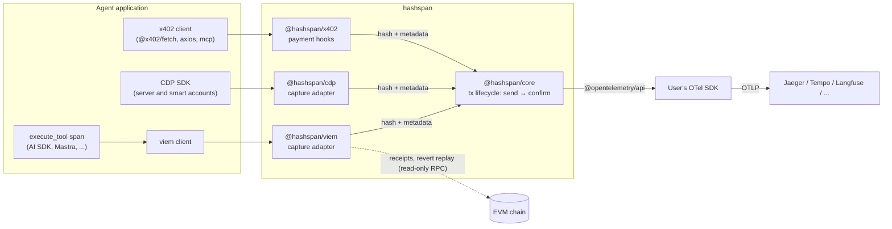

# Architecture

| Component | Purpose | Path |
|---|---|---|
| core | Lifecycle tracker: `send`/`confirm` spans, links, one confirm span per transaction, replaced transactions, fees, privacy modes. No network calls: adapters pass it receipts | `packages/core` |
| viem adapter | Hooks `sendTransaction` / `writeContract` / `waitForTransactionReceipt`, and `sendUserOperation` / `waitForUserOperationReceipt` of a bundler client, via `client.extend()`; background confirmation, `watch()` for transactions sent elsewhere, revert reason decoding by replay, `flush()`; `traceTransport()` records JSON-RPC requests as spans | `packages/viem` |
| cdp adapter | Wraps a Coinbase CDP client in place: sends of server accounts become send spans, user operations of smart accounts user operation spans (ADR 0021); confirmations through a viem reader and `@hashspan/viem`'s `watch()` | `packages/cdp` |
| x402 adapter | Registers hooks on an `x402Client`: each payment becomes a `payment` span, as the facilitator, not the agent, sends the settling transaction; confirmations through a viem reader and `@hashspan/viem`'s `watch()` | `packages/x402` |
| examples | Runnable agent integrations | `examples/` |
| lab | Local Jaeger (Docker) + project-local Anvil | `docker/`, `scripts/`, `Makefile` |

Design decisions: [docs/adr](adr/). Attribute schema: [docs/semconv.md](semconv.md).

## Principles

- **Library, not a service.** Peer dependencies are `@opentelemetry/api` and, for an adapter, the library it
  instruments (`viem`); users bring their own SDK and exporter.
- **Never on the critical path.** Instrumentation failures are swallowed and never change the result of a transaction call.
- **Off the call path.** Nothing the telemetry needs is awaited before the call it traces: no network request, no
  promise. What is known up front (a client with a chain) is recorded synchronously when the call starts; what is
  not is resolved alongside the call and the span is recorded after the fact
  ([ADR 0009](adr/0009-telemetry-off-the-call-path.md)).
- **Read-only.** The library never signs or broadcasts transactions. The core makes no network calls; adapters read
  receipts and replay reverted transactions with read-only requests.
