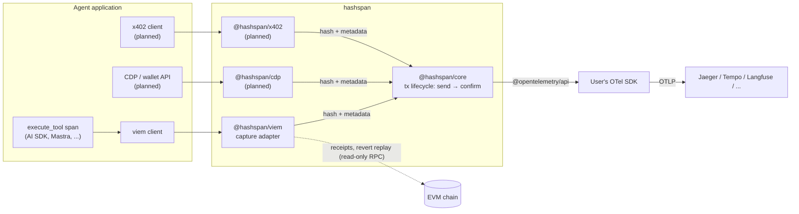

# Architecture

| Component | Purpose | Path |
|---|---|---|
| core | Lifecycle tracker: `send`/`confirm` spans, links, one confirm span per transaction, replaced transactions, fees, privacy modes. No network calls: adapters pass it receipts | `packages/core` |
| viem adapter | Hooks `sendTransaction` / `writeContract` / `waitForTransactionReceipt` via `client.extend()`; background confirmation, revert reason decoding by replay, `flush()`. RPC spans via a transport wrapper are planned (v0.2) | `packages/viem` |
| examples | Runnable agent integrations | `examples/` |
| lab | Local Jaeger (Docker) + project-local Anvil | `docker/`, `scripts/`, `Makefile` |

Design decisions: [docs/adr](adr/). Attribute schema: [docs/semconv.md](semconv.md).

## Principles

- **Library, not a service.** Only `@opentelemetry/api` is a peer dependency; users bring their own SDK and exporter.
- **Never on the critical path.** Instrumentation failures are swallowed and never change the result of a transaction call.
- **Off the call path.** No telemetry work runs before the call it traces; spans may be recorded after the fact
  ([ADR 0009](adr/0009-telemetry-off-the-call-path.md)).
- **Read-only.** The library never signs or broadcasts transactions. The core makes no network calls; adapters read
  receipts and replay reverted transactions with read-only requests.
