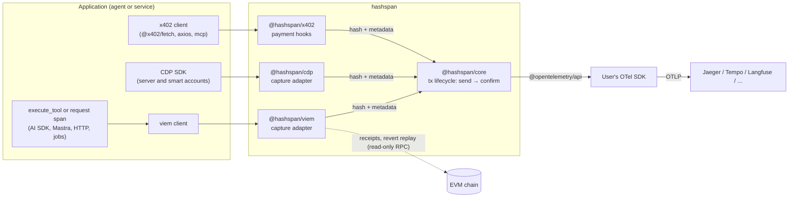

# Architecture

| Component | Purpose | Path |
|---|---|---|
| core | Lifecycle tracker: `send`/`confirm` spans of transactions, user operations and EIP-5792 call batches, `payment` spans, links, one confirm span per transaction, replaced transactions, fees, privacy modes, and send, confirmation and fee histograms (ADR 0020). No network calls: adapters pass it receipts | `packages/core` |
| viem adapter | Hooks `sendTransaction` / `writeContract` / `waitForTransactionReceipt`, `sendUserOperation` / `waitForUserOperationReceipt` of a bundler client, and `sendCalls` / `waitForCallsStatus` (ADR 0022), via `client.extend()`; background confirmation, `watch()` for transactions sent elsewhere, revert reason decoding by replay, `flush()`; `traceTransport()` records JSON-RPC requests as spans | `packages/viem` |
| cdp adapter | Wraps a Coinbase CDP client in place: sends of server accounts become send spans, user operations of smart accounts user operation spans (ADR 0021); confirmations through a viem reader and `@hashspan/viem`'s `watch()` | `packages/cdp` |
| x402 adapter | Registers hooks on an `x402Client`: each payment becomes a `payment` span, as the facilitator, not the agent, sends the settling transaction; confirmations through a viem reader and `@hashspan/viem`'s `watch()`, which also check that the settlement carries the payment (`blockchain.payment.verified`, ADR 0017) | `packages/x402` |
| examples | Runnable agent integrations | `examples/` |
| lab | Local Jaeger (Docker) + project-local Anvil; Prometheus and Grafana with the [dashboards](../dashboards/README.md) | `docker/`, `dashboards/`, `scripts/`, `Makefile` |

Design decisions: [docs/adr](adr/). Attribute schema: [docs/semconv.md](semconv.md).

## Principles

- **Library, not a service.** Peer dependencies are `@opentelemetry/api` and, for an adapter, the library it
  instruments, per the rule in [AGENTS.md](../AGENTS.md#conventions); users bring their own SDK and exporter.
- **Never on the critical path.** Instrumentation failures are swallowed and never change the result of a transaction call.
- **Off the call path.** Nothing the telemetry needs is awaited before the call it traces: no network request, no
  promise. What is known up front (a client with a chain) is recorded synchronously when the call starts; what is
  not is resolved alongside the call and the span is recorded after the fact
  ([ADR 0009](adr/0009-telemetry-off-the-call-path.md)).
- **Read-only.** The library never signs or broadcasts transactions. The core makes no network calls; adapters read
  receipts and replay reverted transactions with read-only requests.

## JSON-RPC requests hashspan adds

Agents and services often run against rate-limited endpoints. These are the requests the adapters make in addition to
the traced calls, per case; the integration tests named here count them against the same calls without hashspan, so a
change that adds requests fails them. How often a wait polls depends on when blocks arrive, so polling is counted by
method, not by number.

| Case | Requests added | Option that changes them |
|---|---|---|
| A send and its wait, on a client with a chain (viem; also a raw send, whose fields are parsed locally, and a fee paid in a token, whose asset comes from the call or the receipt) | none | |
| A send on a client without a chain (viem) | one `eth_chainId` per send | give the client a chain |
| Background confirmation and `watch()` (viem; cdp and x402 confirm through `watch()`) | the receipt polling of one `waitForTransactionReceipt` per transaction | `confirm`, `maxBackgroundConfirmations`, `timeoutMs` |
| A reverted transaction (viem, cdp) | one `eth_getTransactionByHash` and one `eth_call` to replay it; one more `eth_call` when the contract was created in the same block ([ADR 0005](adr/0005-revert-reason-replay.md)) | `decodeRevertReason: false` |
| A wait with `confirmations` above 1 (viem) | one `eth_getTransactionReceipt` after the wait resolved; one `eth_getBlockByNumber` more only when that receipt is missing or in another block ([ADR 0026](adr/0026-receipt-after-several-confirmations.md)) | |
| A receipt that carries `operatorFeeScalar` or `operatorFeeConstant` (OP Stack after Isthmus, on a chain that charges an operator fee; viem, cdp with a reader) | one `eth_call` to the GasPriceOracle's `getOperatorFee(gasUsed)` at the receipt's block, per transaction ([OP Stack operator fee](../packages/viem/README.md#op-stack-operator-fee)); none for a receipt without the fields | |
| A preconfirmed receipt (flashblocks) | `eth_getTransactionReceipt` once per polling interval until the sealed receipt, at most 30 s ([Preconfirmed receipts](../packages/viem/README.md#preconfirmed-receipts-flashblocks)) | |
| A user operation (viem bundler client) | none | |
| A user operation of a CDP smart account, with a reader | `eth_getTransactionReceipt` of the bundle transaction, polled until found or `confirmTimeoutMs` ([ADR 0021](adr/0021-user-operations.md)) | no `reader` |
| An x402 payment with a reader | the settling transaction's receipt; for Permit2 also its transaction, once | no `reader` |

Tests: `packages/viem/test/request-count.int.test.ts`, the request-count tests of
`packages/viem/test/user-operation.int.test.ts`, `packages/x402/test/settlement.int.test.ts` and
`packages/x402/test/permit2-settlement.int.test.ts`.
