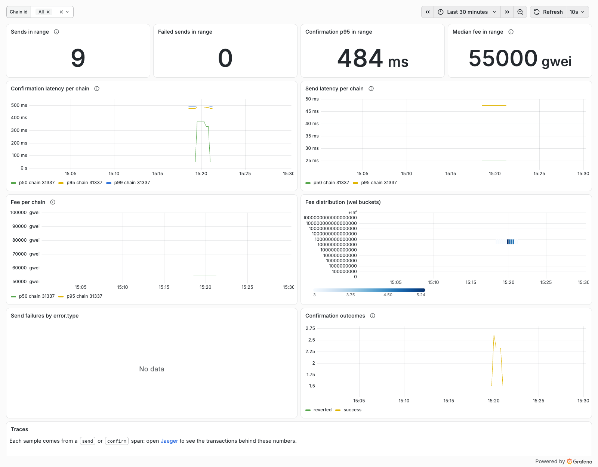

# Tracing backends

hashspan emits standard OpenTelemetry spans and has no exporter of its own: the spans go wherever your
OpenTelemetry SDK exports to. Point the SDK's OTLP exporter at your backend with the standard variables:

```sh
OTEL_EXPORTER_OTLP_ENDPOINT=https://your-backend:4318   # base URL; the HTTP exporter appends /v1/traces
OTEL_EXPORTER_OTLP_HEADERS="key1=value1,key2=value2"     # authentication, if the backend needs it
```

The example agent's setup ([`examples/ai-sdk-agent/src/telemetry.ts`](../examples/ai-sdk-agent/src/telemetry.ts))
uses `@opentelemetry/exporter-trace-otlp-proto`, which reads both. Each setup below was run once with `make demo`
against hashspan 0.5.0 on 2026-10-02; the versions tested are listed with each backend. Keep keys out of shell
history and out of the repository, for example with `read -rs KEY` before running the command.

## Jaeger

The [local lab](../README.md#local-lab) starts Jaeger on `http://localhost:4318`, the exporter's default endpoint, so
`make demo` needs no variables. Open `http://localhost:16686`, pick the `treasury-agent` service and expand
`withdraw_from_vault`.

## Grafana Tempo

Tested with Tempo 3.0.0 and Grafana 13.2.3, both in Docker.

```sh
OTEL_EXPORTER_OTLP_ENDPOINT=http://your-tempo:4318
```

Tempo accepts OTLP only on the receivers its distributor enables:

```yaml
distributor:
  receivers:
    otlp:
      protocols:
        http:
          endpoint: 0.0.0.0:4318
```

In Grafana, open Explore with the Tempo data source and search for the trace. The reverted `confirm 31337` span is
marked as an error, with every `blockchain.*` attribute in its span attributes. TraceQL can query them, including
across the agent's tool call:

```text
{span.error.type = "reverted"} | select(span.blockchain.tx.revert.reason, span.blockchain.tx.fee)
{span.gen_ai.tool.name = "withdraw_from_vault"} >> {span.blockchain.operation.name = "confirm" && status = error}
```

The second query finds failed confirmations under a given tool. When you call Tempo's search API directly, pass
`start` and `end`: without a time range, Tempo 3.0.0 returned no traces for these queries.

Grafana Cloud takes the same variables with the OTLP endpoint and Basic authentication header shown in your stack's
OpenTelemetry settings; it was not part of this test.

## Langfuse

Tested with Langfuse 4.49.0, self-hosted with its Docker Compose file. Langfuse Cloud uses the same API.

```sh
OTEL_EXPORTER_OTLP_ENDPOINT=https://cloud.langfuse.com/api/public/otel   # US: https://us.cloud.langfuse.com/api/public/otel
OTEL_EXPORTER_OTLP_HEADERS="Authorization=Basic $LANGFUSE_AUTH,x-langfuse-ingestion-version=4"
```

`LANGFUSE_AUTH` is `printf '%s:%s' "$PUBLIC_KEY" "$SECRET_KEY" | base64`, from a project's API keys. For a
self-hosted instance the endpoint is `http://your-langfuse:3000/api/public/otel`. Langfuse accepts OTLP over HTTP
only (JSON or protobuf), not gRPC. See [Langfuse's OpenTelemetry guide](https://langfuse.com/docs/opentelemetry/get-started).

Langfuse maps GenAI spans to its own observation types: `invoke_agent` becomes an agent, `execute_tool` a tool named
after the tool, `chat` a generation. `send`, `confirm` and `payment` spans are plain spans; the reverted confirm span
has level `ERROR`, and its attributes are in the observation's metadata as `attributes.blockchain.*`.

Langfuse stores an attribute string that looks like a number as a number when it can do so without losing precision.
A wei value such as `blockchain.tx.fee` can therefore come back as a number on one span (`40616290500000`) and as a
string on another (`"1234567890123456789"`); take that into account when filtering or exporting.

## Honeycomb

Tested with Honeycomb's free plan, US region.

```sh
OTEL_EXPORTER_OTLP_ENDPOINT=https://api.honeycomb.io   # EU: https://api.eu1.honeycomb.io
OTEL_EXPORTER_OTLP_HEADERS="x-honeycomb-team=$HONEYCOMB_API_KEY"
```

Use an ingest key from your environment's API keys. The spans land in a dataset named after `service.name`
(`treasury-agent` for the example). Attribute types are kept: wei amounts are strings, counts are integers. Query
`WHERE blockchain.tx.status = reverted` and open the trace: the failed `confirm 31337` span sits under
`execute_tool withdraw_from_vault`, and the link to its `send` span shows on the span. Honeycomb also recognizes the
GenAI spans, so the agent span shows its model and token usage. See
[Honeycomb's OpenTelemetry docs](https://docs.honeycomb.io/send-data/opentelemetry/).

## Grafana dashboard for the metrics

hashspan's tracker records three histograms ([metrics](semconv.md#metrics)): send duration, confirmation duration and
fee. [`docker/grafana/dashboards/hashspan.json`](../docker/grafana/dashboards/hashspan.json) is a ready Grafana
dashboard for them, on a Prometheus data source: confirmation and send latency percentiles per chain, fees per chain
and their distribution, send failures by `error.type`, and confirmation outcomes, with a chain id filter.



In the local lab, `make lab-metrics` starts Prometheus (with its OTLP receiver) and Grafana with the dashboard
provisioned; `make demo` then sends the example agent's metrics to Prometheus, and the dashboard is on
`http://localhost:3000`. Tested with Prometheus 3.15.0 and Grafana 13.2.3. To use the dashboard elsewhere, send the
metrics over OTLP to a Prometheus-compatible backend and import the file:

- Prometheus needs `--web.enable-otlp-receiver` and turns `blockchain.client.send.duration` (unit `s`) into
  `blockchain_client_send_duration_seconds` and attributes into labels such as `blockchain_chain_id` and
  `error_type`, as in [`docker/prometheus.yml`](../docker/prometheus.yml).
- A process that exports only once before it exits, such as a short script, leaves one sample per series, and
  `rate()` needs two: the lab enables `--enable-feature=created-timestamp-zero-ingestion`, so Prometheus adds a zero
  sample at each series' start time. Long-running agents need neither.
- The dashboard's data source is the one with uid `hashspan-prometheus`; pick yours when you import it.

